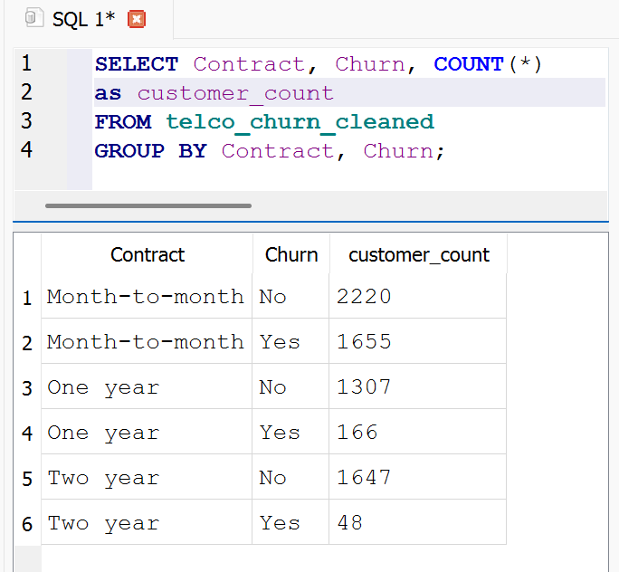
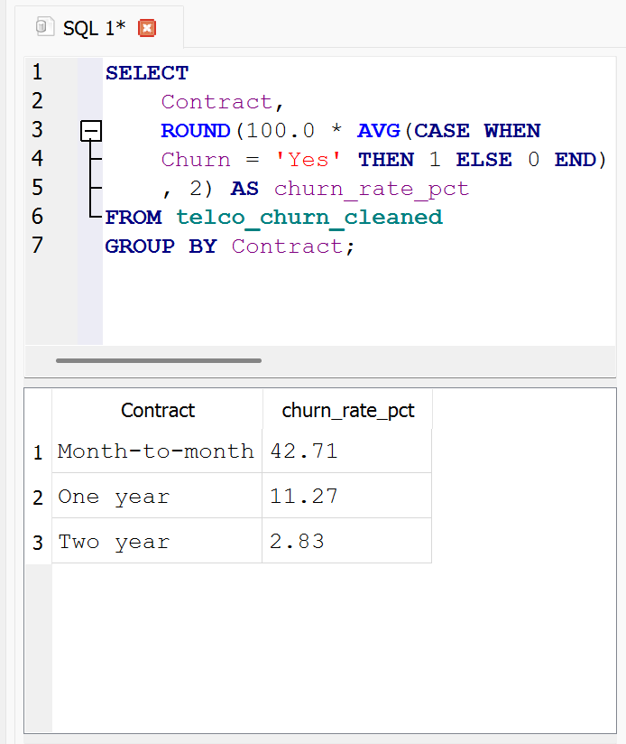
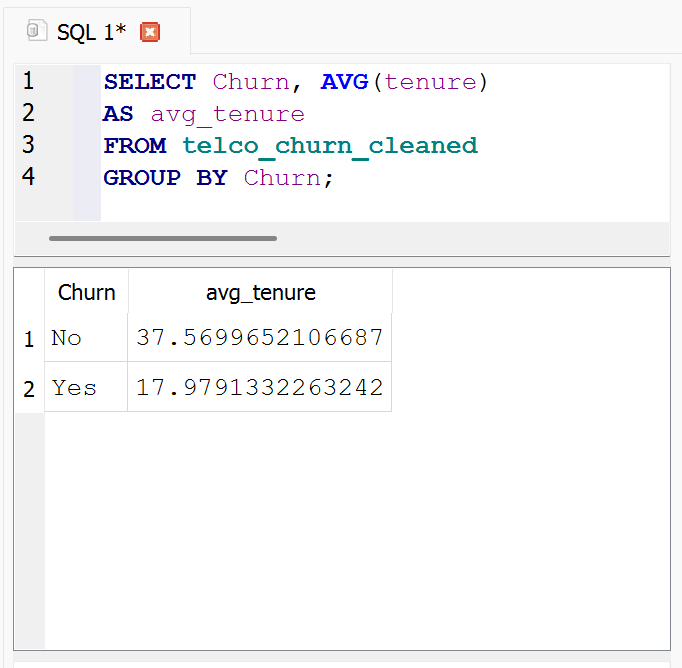
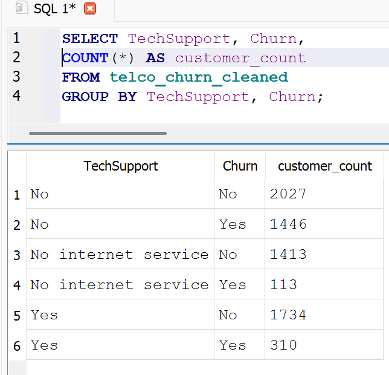
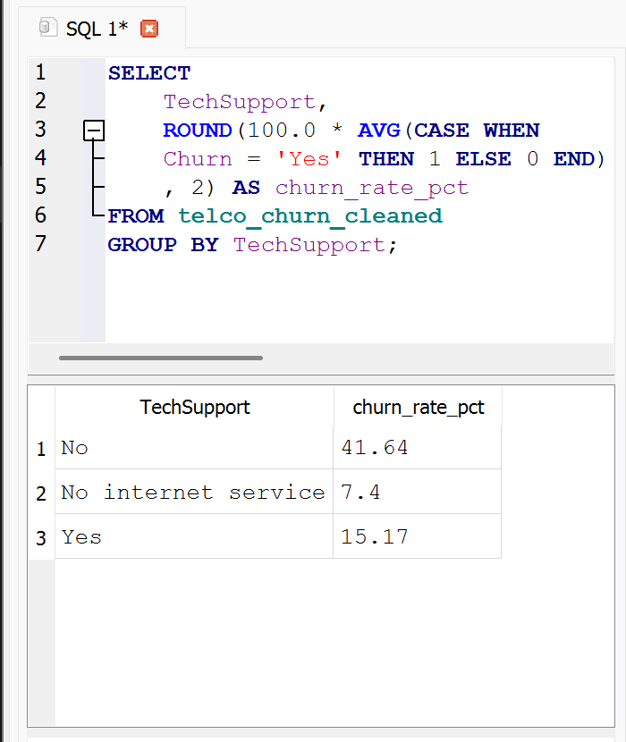
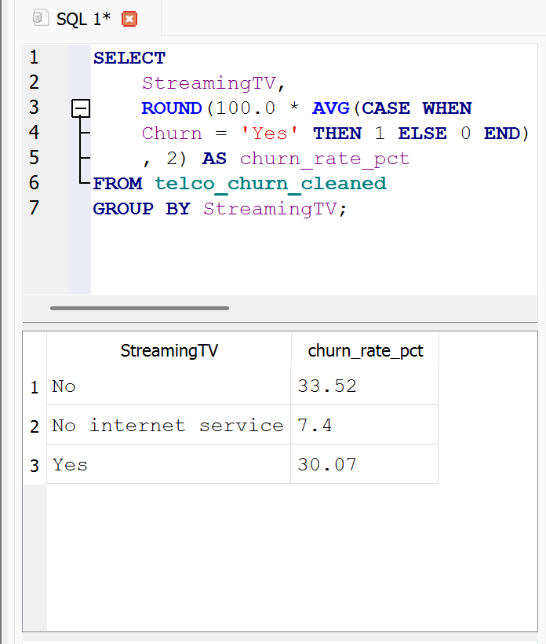
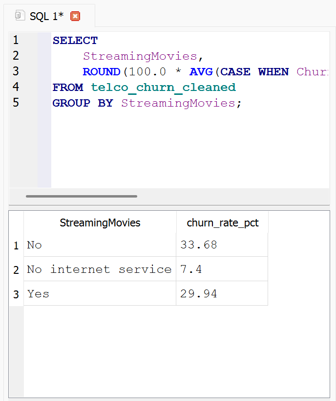
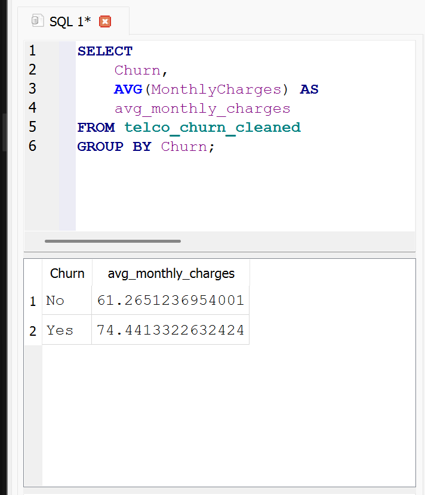

# Telecom Customer Churn — SQL Query Results

**Main question:** Why are customers leaving this telecom provider, and what should the company do about it?

**Tools used:** Python (Pandas, in Google Colab) for cleaning, SQLite (DB Browser) for querying, Power BI for the final dashboard.

**Cleaning note:** 11 rows were dropped after converting `TotalCharges` to a numeric column (`pd.to_numeric(df['TotalCharges'], errors='coerce')`) and removing rows with missing values (`df.dropna()`).

For the raw, copy-runnable version of these queries, see [`queries.sql`](./queries.sql).

---

## Sub-question 1: Does churn rate differ by contract type?

**Query — raw counts by contract type and churn status:**
```sql
SELECT Contract, Churn, COUNT(*) AS customer_count
FROM telco_churn_cleaned
GROUP BY Contract, Churn;
```


**Query — churn rate (%) by contract type:**
```sql
SELECT
    Contract,
    ROUND(100.0 * AVG(CASE WHEN Churn = 'Yes' THEN 1 ELSE 0 END), 2) AS churn_rate_pct
FROM telco_churn_cleaned
GROUP BY Contract;
```



**Finding:** The longer the contract, the lower the churn rate — **Month-to-month: 42.71%**, **One year: 11.27%**, **Two year: 2.83%**. Contract length is the single strongest pattern in this dataset.

---

## Sub-question 2: Does churn rate differ by tenure (new vs. long-term customers)?

**Query:**
```sql
SELECT Churn, AVG(tenure) AS avg_tenure
FROM telco_churn_cleaned
GROUP BY Churn;
```



**Finding:** Customers who stayed average **37.6 months** of tenure; customers who churned average only **17.9 months**. Newer customers churn far more than long-term customers.

---

## Sub-question 3: Do add-on services (tech support, streaming) correlate with lower churn?

**Tech Support — raw counts:**
```sql
SELECT TechSupport, Churn, COUNT(*) AS customer_count
FROM telco_churn_cleaned
GROUP BY TechSupport, Churn;
```



**Tech Support — churn rate (%):**
```sql
SELECT
    TechSupport,
    ROUND(100.0 * AVG(CASE WHEN Churn = 'Yes' THEN 1 ELSE 0 END), 2) AS churn_rate_pct
FROM telco_churn_cleaned
GROUP BY TechSupport;
```



**Finding:** Customers **without** tech support churn far more (**41.64%**) than those **with** tech support (**15.17%**). Customers with no internet service at all churn least (**7.4%**), since they have fewer things to be dissatisfied with in the first place.

**Streaming TV — churn rate (%):**
```sql
SELECT
    StreamingTV,
    ROUND(100.0 * AVG(CASE WHEN Churn = 'Yes' THEN 1 ELSE 0 END), 2) AS churn_rate_pct
FROM telco_churn_cleaned
GROUP BY StreamingTV;
```



**Streaming Movies — churn rate (%):**
```sql
SELECT
    StreamingMovies,
    ROUND(100.0 * AVG(CASE WHEN Churn = 'Yes' THEN 1 ELSE 0 END), 2) AS churn_rate_pct
FROM telco_churn_cleaned
GROUP BY StreamingMovies;
```



**Finding:** Streaming TV and Streaming Movies show a much smaller gap than tech support does — roughly 30-34% churn regardless of whether the customer has the service, versus 7.4% for customers with no internet service at all. **Tech support has the strongest relationship with churn** among the three add-ons tested; streaming services show only a small effect by comparison.

---

## Sub-question 4: Is there a pricing/charges pattern among customers who churn?

**Query:**
```sql
SELECT
    Churn,
    AVG(MonthlyCharges) AS avg_monthly_charges
FROM telco_churn_cleaned
GROUP BY Churn;
```



**Finding:** Customers who churn pay slightly more on average (**$74.44/month**) than customers who stay (**$61.27/month**). The gap exists but is fairly modest, not a dramatic difference.

---

## Overall Takeaways

1. **Contract length is the biggest churn driver** — month-to-month customers churn at roughly 15x the rate of two-year contract customers.
2. **New customers are at the highest risk** — churned customers have less than half the average tenure of retained customers.
3. **Lack of tech support is strongly associated with churn** — customers without it churn at nearly 3x the rate of those with it, a much stronger effect than streaming add-ons show.
4. **Pricing plays a smaller, secondary role** — churned customers pay somewhat more on average, but the difference is modest compared to the contract and tech-support effects above.

These findings feed directly into the [executive summary](executive_summary.pdf) and the [Power BI dashboard](dashboard/).
